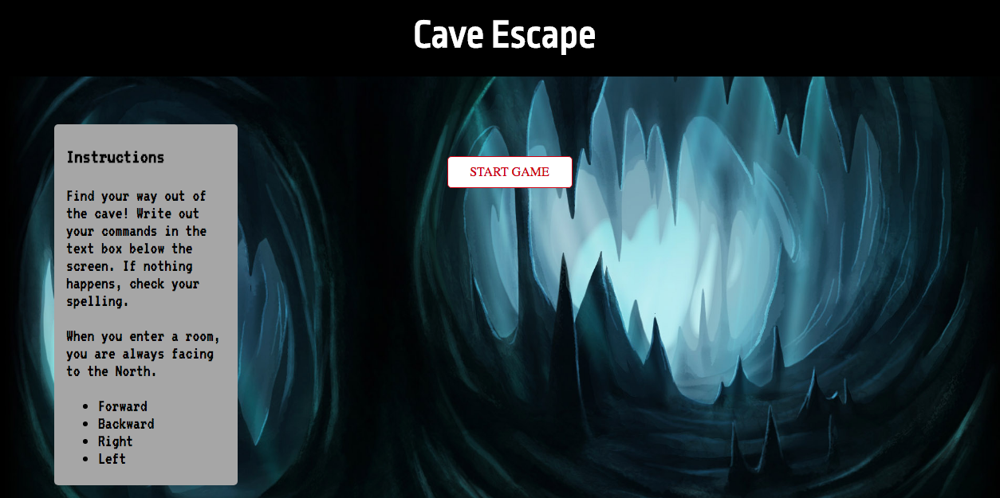
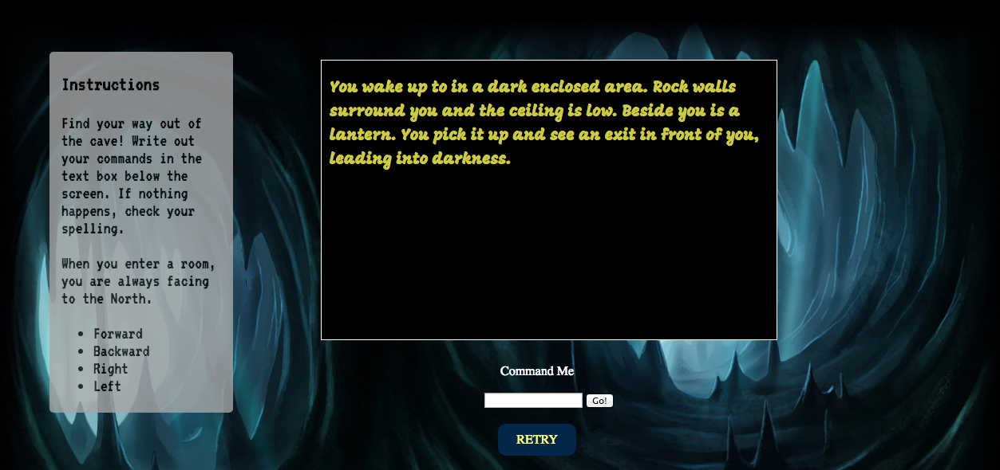

# Cave Escape Project

Cave Escape is a game where the player wakes up in a cave and must navigate their way through the maze to get to freedom. They move from area to area by typing in commands in the prompt underneath the game window. When the player wants to start over they can click on the "Retry" button which will return them to the starting room. The commands are clearly outlined in the instruction box to the left of the game window. The player moves by typing in left, right, forwards, and backwards. 

## Whiteboarding Images

These are concepts I drew on whiteboards when initially planning out the game. They detail the generic layout and features I had planned. 

### Map Initial Concept
First draft of the map of my game. I used this to see how many rooms I could expect to have if I had the time to make the game semi-complicated. Included potential concepts to trick the player, including circular layouts and dead ends.

### Map Fixed
The original photo had a typo in it (two Room #11s) so I cleaned it up. Decided to go with this layout for now since it makes sense, even though it might be a bit complicated to write out.

### Landing Page 1.0
Quick first draft of what I wanted the landing page to look like. Not very detailed.

### Landing Page 2.0
Much more detailed landing page. Used as a framework for when I wrote the HTML and CSS for the page.

### MVP Features
First draft of the features I wanted for the minimally viable product. Mostly focused on thinking about the logic behind how the game would work.

### Extra Features
Some of the features I wanted to develop if time allowed. Some of them are unrealistic for my current ability with JavaScript

## Checklist
Initial checklist for creating the game. Didn't have the time to list more than the MVP features.

### Priority Matrix
Priority matrix for the game. Took the points from the checklist and organized them based on what I thought would take longer and what was a priority. See the checklist for details. Also doesn't include extra features. 

## Game Components

### Landing Page
This is what the player will see when they load into the game. The instructions will be clearly visible and the player won't be able to start the game until they click on the "Start Game" button. 

### Game Initialization
After clicking the "Start Button" the game window should appear as depicted while the button fades into the background. From here the player can input commands and navigate around the cave. 

### Playing the Game
After entering a valid command the player should see the text in the game window change to reflect what part of the cave the player is in. Each section has a unique description so the player can remember places they've been before. Entering an invalid command will result in no action taking place, while attempting to walk in a direction with no exit will result in a pop up telling the player they banged their head against the wall. As they travel the player will reach dead ends and circles, causing them to potentially lose their bearings temporarily.

### Winning the Game
The player wins the game when they've reached the exit to the cave. A congratulatory message will display, telling the player they've escaped from the cave successfully, and if they wish to try again to press the "Retry" button. 

### Functional Components

|Component|Priority|Estimated Time|Time Invested|
|---------|--------|--------------|-------------|
|Landing Page| H   | 1.5h         | 2h          |
|Room Classes| H   | 2h           | 1.5h        |
|Move Function| H  | 10h          | 14h         |
|Reset Function| H | 30m          | 15m         |
|Start Game| M     | 1h           | 45m         |
|Song |  M         | 4h           | 2h          |   

## Additional Libraries
I used JQuery to grab DOM elements and use them in my JavaScript functions. 

## Issues and Resolutions

### Defining each Room Class
When initially working on my constructor function for my room I realized that if I tried defining a room as a property of another room before it was defined in my code it wouldn't be recognized as a variable and my code wouldn't run. I fixed this by redefining the forward, backward, left, and right properties of rooms after defining all the rooms in my JS file when those rooms connected to rooms defined after them. 

### Creating a Functioning Game Class
I originally wanted to create a separate class to render my game and include the move function as a method, but I was having difficulty getting the method to run properly. It was easier to define and call the function outside of the class, so I got it working that way. 

### Playing a Song in a Specific Room

As a fun extra feature I wanted to play a song when the player reached the penultimate part of the cave. I managed to get the song to play when the page loaded through an audio tag in the HTML, but wasn't sure how to write the function to have it play. My first attempt was adding in a separate if statement in my move function, but that caused the function to not run at all. I then tried to write a separate function also trying it to the .submit() event in JQuery, but that wasn't responding at all. I searched online and even asked a question on Stack Overflow, but was unable to find a way to get the song to play. I ended with using a .keyup() function and having the song play if event.which === 13 (keycode for the enter key) and the currentRoom variable (where I stored what room the player was in) was equal to the class defining the second-to-last room in the cave.

